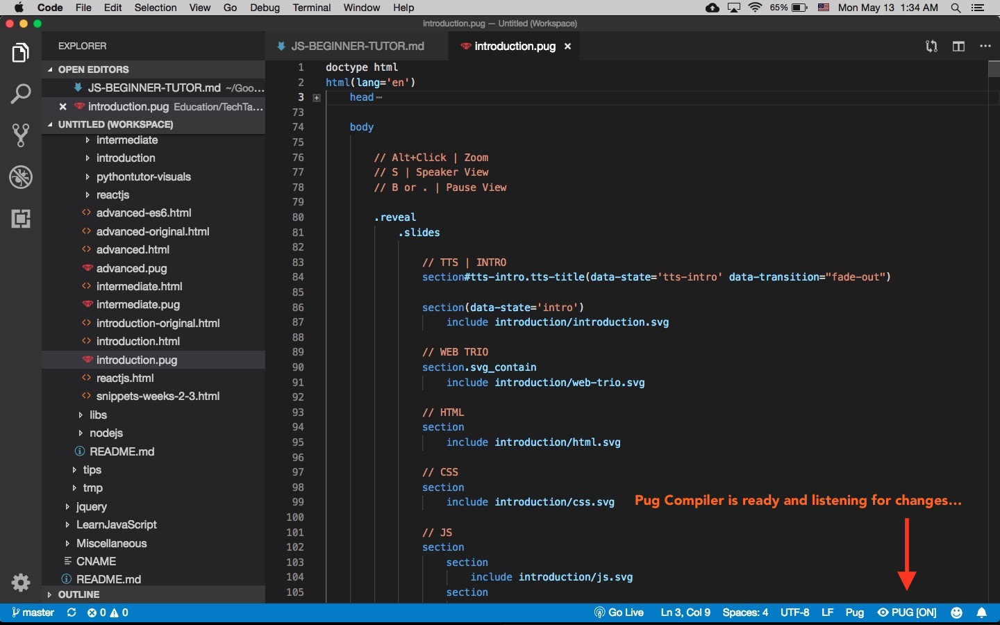
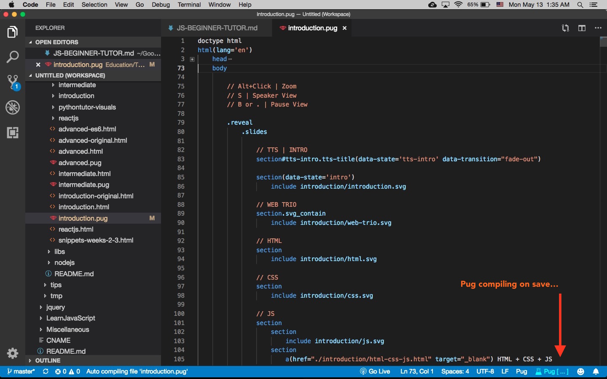

# Pug Auto Compiler [Work in Progress]
## Visual Studio Code Extension

(Based on TypeScript Auto Compiler by @morissonmaciel)

This is a Pug extension designed to build automatically any opened .pug on file changes.

> Important Note: this extension still is in BETA build and may not work properly in specific scenarios
Fill free to report any bugs and features in [GitHub Extension Repository](https://github.com/kostasx/vscode-pug-compiler). 

## Features

* Build automatically `.pug` Pug files changed in editor

## Requirements

External Pug compiler (aka `pug`) must be installed to work properly.

```
npm install -g pug
```
## Installation

* Download repository and unzip it in the VSCode extensions folder:

| OS | VSCode Extensions Directory |
|---------|----------------------------------|
| Windows | `%USERPROFILE%\.vscode\extensions` |
| Mac | `$HOME/.vscode/extensions` |
| Linux | `$HOME/.vscode/extensions` |

* Reload VSCode
* Click Save on a file with a .pug extension

## Extension Settings

## Release Notes

### 0.1.0

Initial release of vscode-pug-compiler
 

-----------------------------------------------------------------------------------------------------------

## Screenshots




